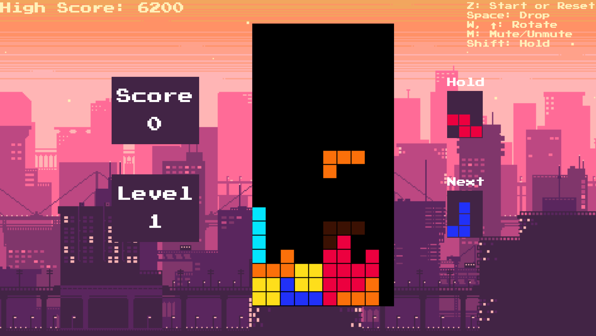

# Tetris19
HTML5 Canvas ES6 JavaScript clone of Tetris. 

Hosted live on [my website](http://www.jeremyfriedel.com/Tetris)

+ Uses HTML5 Canvas with vanilla ES6 JavaScript to give an engaging visual and audio experience using native JavaScript.
+ Separate logic and presentation in Object Oriented ES6 classes, allowing for greater developer flexibility and a clean codebase.
+ Complete clone of the classic game, including modern additions.
+ Uses webpack and babel configuration to serve even legacy browsers with a modern JavaScript ES6 Application.

# Getting Started!

+ To play a live version go to [here](http://www.jeremyfriedel.com/Tetris)
+ To play a local version, download the repository and simply load dist/index.html
+ To modify a local version, simply run webpack again for your changes to be in effect.

